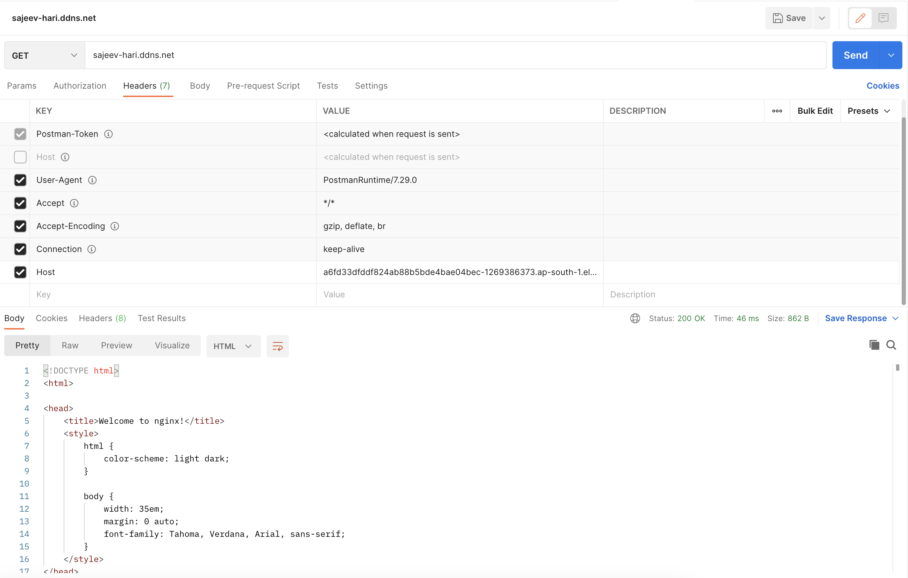
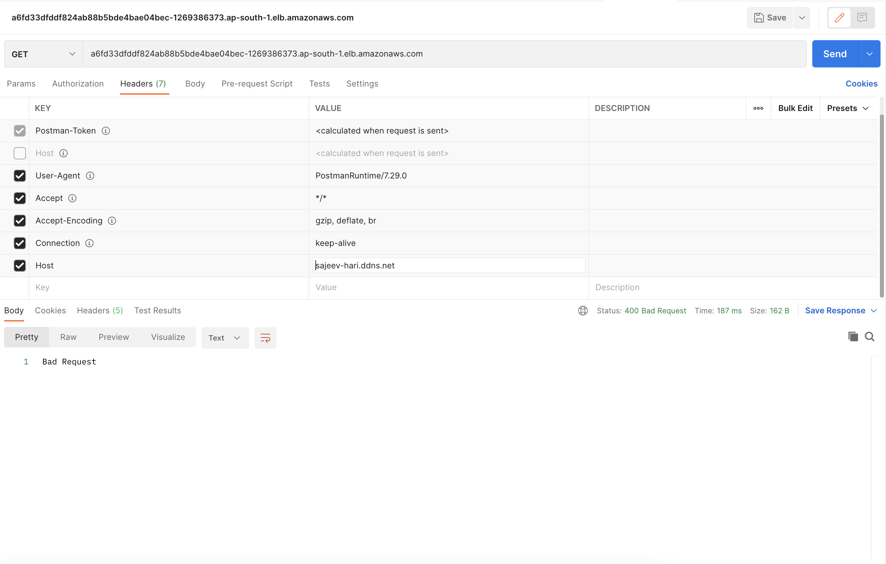

# Istio-Virtual-Service-POC

This POC is about understanding virtual service network flow with istio ingress gateway integration.

## Application Setup
- Two different versions of nginx deployment in default namespace
- One service for both nginx deployments
- One client pod in default namespace
- One client pod in different namespace (sample)

Without istio, the nginx service will route traffic in 50-50 fashion to both deployments for both client pods.

## Istio Setup
- One ingress gateway
- One virtual service
- One destination rule for nginx service

## Requirement
Route traffic to different versions of nginx pods in 90-10 fashion (Canary).

### Traffic
- Calls from outside the cluster (Ex: browser, curl).
- Calls from client within the cluster in same namespace where istio is enabled (client with envoy proxy).
- Calls from client within cluster in different namespace (sample) without istio injection (client without envoy proxy).

## POC Insights

```
apiVersion: networking.istio.io/v1alpha3
kind: VirtualService
metadata:
  name: nginx-virtual-service
spec:
  hosts:
    - nginx-service.default.svc.cluster.local # K8s service name
    - a329d0ecf25064571aa269f461710fb1-667026945.ap-south-1.elb.amazonaws.com # Istio ingress LB
  gateways:
    - mesh # Required when virtual service config should apply to clients inside mesh
    - ingress-gateway # istio ingress gateway name
  http:
    - route:
        - destination:
            host: nginx-service.default.svc.cluster.local
            subset: version1
          weight: 90
        - destination:
            host: nginx-service.default.svc.cluster.local
            subset: version2
          weight: 10
---
```

### Parameter definitions
**spec.hosts:** Hosts (url in the host header of client request) can be in any form like load balancer domain name (Istio ingress LB) or kubernetes service name (FQDN) or a wildcard pattern. Only when clients use these urls, the defined routing configurations will be executed.

For example, clients outside the cluster will use the Istio ingress load balancer url and clients inside the cluster will use the K8s service DNS name (nginx-service.default.svc.cluster.local);

The hosts values are validated from the host header of the client requests.

if the host header of the request is same as the host defined in the virtual service (as well as gateway), the request enter the service mesh.


if the host header of the request is not same as the host defined in the virtual service (as well as gateway), the service mesh can't find the requested resource.


**spec.gateway:** The names of gateways and sidecars that should apply these routes. 
- When this field is omitted, the default gateway (mesh) will be used, which would **apply the rule to all sidecars in the mesh**. 
- If a list of gateway names is provided, the rules will **apply only to the gateways**. 
- To apply the rules to both gateways and sidecars, specify mesh as one of the gateway names.

```
Note: The reserved word mesh is used to imply all the sidecars in the mesh. 
```

For more details refer [Virtual Serivce](https://istio.io/latest/docs/reference/config/networking/virtual-service/#VirtualService).

With above configuration, the traffic routing defined in the virtual service is applicable only for the **first two traffic requirements**. 

For the client outside the istio injected namespace, this virtual service config is not applicable, as the client pod will not have the envoy proxy.